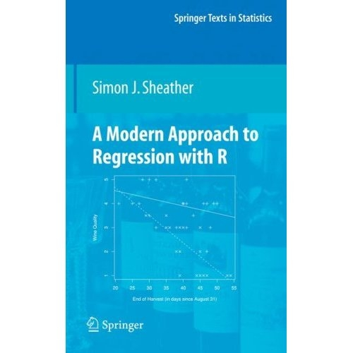

<!-- README.md is generated from README.Rmd. Please edit that file -->

```{r, echo = FALSE}
knitr::opts_chunk$set(
  collapse = TRUE,
  comment = "#>",
  fig.path = "README-"
)
```

modernregressiondata
====================

R package of data sets used in [Modern Approach to Regression with R](http://www.stat.tamu.edu/~sheather/book/index.php) (2009) by Simon J. Sheather.




Installation
------------

Get the development version from GitHub:

``` r
# If you haven't installed devtools yet, do so:
# install.packages("devtools")
devtools::install_github("aloy/modernregressiondata")
```

Data Sets
---------

To see a list of all data sets, type:

```{r eval=FALSE}
data(package = "modernregressiondata")
```

To load a particular data set, `AdRevenue` for example, type:

```{r eval=FALSE}
data(AdRevenue)
```
